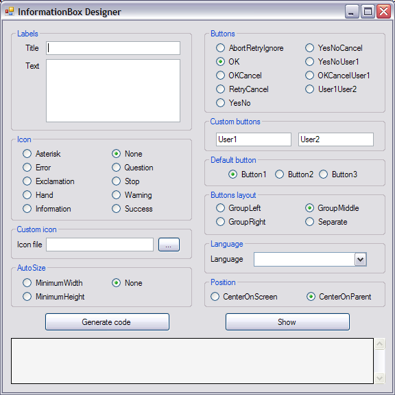
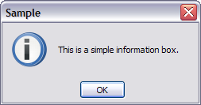
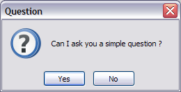
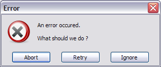
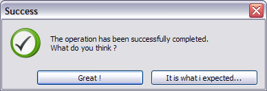
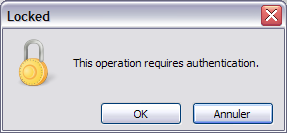

This page contains screenshots of the [release:0.4.1.0 release](5590) for the framework 2.0.

_The designer._

_A simple information box._

_A simple question box._

_An error message with a multiline text and a custom button placement (constant space)._

_Success box with right aligned buttons and custom button texts._

_A box with a custom icon, translated button texts, and button 2 as the default button._